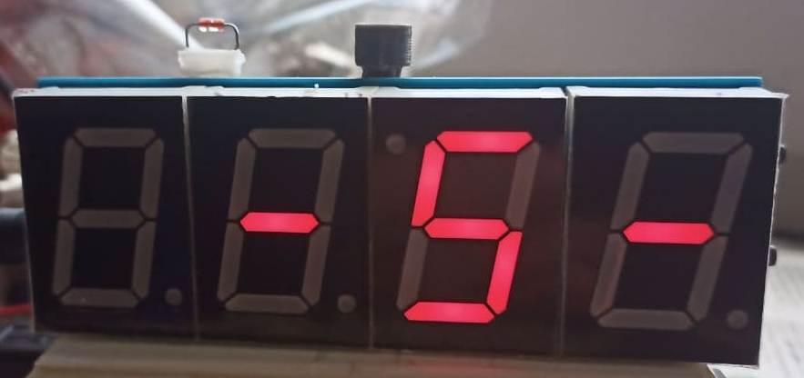
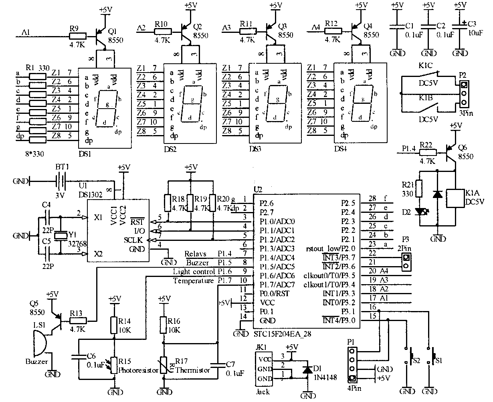
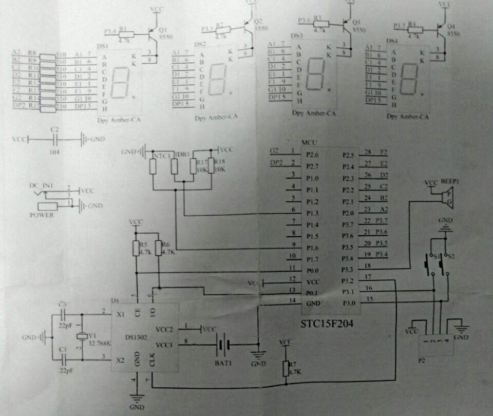
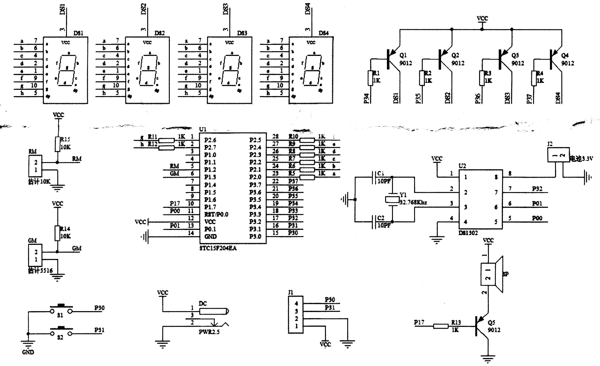
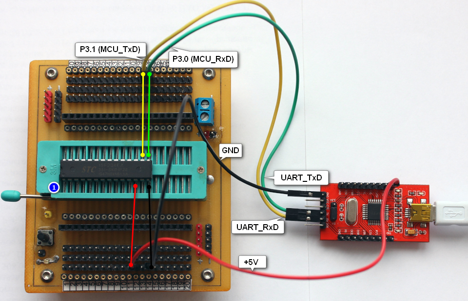
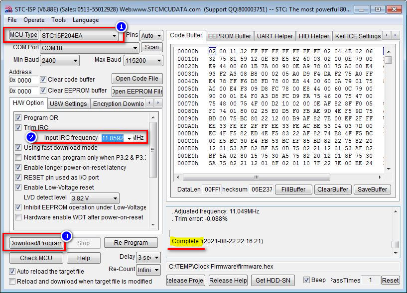

# STC DIY Clock Kit firmware

Firmware replacement for STC15F mcu-based DIY Clock Kit (available from banggood [see below for link], aliexpress, et al.) Uses [sdcc](http://sdcc.sf.net) to build and [stcgal](https://github.com/grigorig/stcgal) to flash firmware on to STC15F204EA (and STC15W408AS) series microcontroller.


[link to Banggood product page for SKU 972289](http://www.banggood.com/DIY-4-Digit-LED-Electronic-Clock-Kit-Temperature-Light-Control-Version-p-972289.html?p=WX0407753399201409DA)

## features
* time display/set (12/24 hour modes)
* date display/set (with reversible MM/YY, YY/MM display)
* day of week (mnemo and digital show of the week day is possible)
If the -DSHOW_DIGIT_WEEKDAY parameter is defined when building the firmware, the weekday will be digitally displayed, please see  

* year
* seconds display/reset
* display auto-dim
* temperature display in C or F (with user-defined offset adjustment)
* alarm with snooze
* hourly chime

## Experimental support
* time sync to GPS receiver outputting serial NMEA data
  * on `gps` branch: https://github.com/zerog2k/stc_diyclock/tree/gps
  * for STC15W408AS or STC15W404AS (sorry no STC15F204EA, not enough ram/code, no hw uart)
  * very experimental at this point (help wanted to polish this)

**note this project in development and a work-in-progress**
*Pull requests are welcome.*

## TODOs
* time sync to WWVB radio receiver module (for STC15W408AS)

## hardware

* DIY LED Clock kit, based on STC15F204EA and DS1302, e.g. [Banggood SKU 972289](http://www.banggood.com/DIY-4-Digit-LED-Electronic-Clock-Kit-Temperature-Light-Control-Version-p-972289.html?p=WX0407753399201409DA)
* connected to PC via cheap USB-UART adapter, e.g. CP2102, CH340G. [Banggood: CP2102 USB-UART adapter](http://www.banggood.com/CJMCU-CP2102-USB-To-TTLSerial-Module-UART-STC-Downloader-p-970993.html?p=WX0407753399201409DA)

There are different modifications of the hardware. Firmware can be built for the following hardware schemes:

a.


In the header file ".\src\hwconfig.h", comment out the definitions: **HW_MODEL_C** and **HW_MODEL_D**, you should get the following:

```
// #define HW_MODEL_C
// #define HW_MODEL_D
```

b.


In the header file ".\src\hwconfig.h", uncomment out the definition **HW_MODEL_C**, you should get the following:

```
#define HW_MODEL_C
// #define HW_MODEL_D
```

d.


In the header file ".\src\hwconfig.h", uncomment out the definition **HW_MODEL_D**, you should get the following:

```
// #define HW_MODEL_C
#define HW_MODEL_D
```

## connection
|   P1 header   | UART adapter |
|:--------------|:-------------|
| P3.1(MCU_TxD) | UART_RxD     |
| P3.0(MCU_RxD) | UART_TxD     |
| GND           | GND          |
| 5V            | 5V           |

Please see example of UART adapter (FTDI232BL) connection to MCU  


## requirements
* linux or mac (windows untested, but should work)
* sdcc installed and in the path (recommend sdcc >= 3.5.0)
* stcgal (or optionally stc-isp). Note you can either do `git clone --recursive ...` when you check this repo out, or do `git submodule update --init --recursive` in order to fetch stcgal.

## usage
choose platformio (preferred) or traditional make build

### platformio support

* assumes you have platformio installed
* choose which mcu you are building for by uncommenting one `env_default` in `platformio.ini`
* adjust `upload_port` as needed in `platformio.ini`

### traditional make
```
make clean
make
make flash
```

#### make options
* override default serial port:
`STCGALPORT=/dev/ttyUSB0 make flash`

* add other options:
`STCGALOPTS="-l 9600 -b 9600" make flash`

* flashing STC15W408AS:
`STCGALPROT="stc15" make flash`

## pre-compiled binaries
If you like, you can try pre-compiled binaries here:
https://github.com/zerog2k/stc_diyclock/releases

## use STC-ISP flash tool
Instead of stcgal, you could alternatively use the official stc-isp tool, e.g stc-isp-15xx-v6.85I.exe, to flash.
A windows app, but also works fine for me under mac and linux with wine.

You can download the STC-ISP v6.88E (2021-04-26) programming software from [here](https://1drv.ms/u/s!ApCcDr7Mqk6whRResLwsi1LjsYMr?e=uqa1ZT).

An example of flashing the MCU via the [STC-ISP v6.88E](https://1drv.ms/u/s!ApCcDr7Mqk6whRResLwsi1LjsYMr?e=uqa1ZT) software please see  


Run the STC-ISP software by clicking the exe file. Windows will ask permission to run the file so say yes. The program pops up a garbled message about eeprom so just click OK and it will run. Select your COM port, the STC15F204EA MCU, and a 11.059200 MHz clock speed. Use the Open Code File button to load your code and data. Then click the Download Program button. Now turn the power off and back on for the MCU by opening and closing the switch in the positive line connection between the MCU and the UART adapter. The download process should start and finish pretty quickly.

After successful flashing in the [report of flash STC15F204EA](docs/report_of_flash_MCU.txt) - "Complete!"

**NOTE**: There is no way to read the original firmware that's in the chip so you can't revert back to it. If you want to keep the original operation of the MCU, you should put the original chip aside and buy new blank chips for experimenting.

~**Note** due to optimizations that make use of "eeprom" section for holding lookup tables, if you are using 4k flash model mcu AND if using stc-isp tool, you must flash main.hex (as code file) and eeprom.hex (as eeprom file). (Ignore stc-isp warning about exceeding space when loading code file.)~ (not really needed anymore as current build is within 4k code)
To generate eeprom.hex, run:
```
make eeprom
```

## clock assumptions
For STC15F204EA, some of the code assumes 11.0592 MHz internal RC system clock (set by stc-isp or stcgal).
For example, delay routines might need to be adjusted if this is different. (Most timing has been moved to hardware timers.)

## disclaimers
This code is provided as-is, with NO guarantees or liabilities.
As the original firmware loaded on an STC MCU cannot be downloaded or backed up, it cannot be restored. If you are not comfortable with experimenting, I suggest obtaining another blank STC MCU and using this to test, so that you can move back to original firmware, if desired.

### references
http://www.stcmcu.com (mostly in Chinese)

stc15f204ea english datasheet:
http://www.stcmcu.com/datasheet/stc/stc-ad-pdf/stc15f204ea-series-english.pdf

stc15w408as english datasheet:
http://www.stcmicro.com/datasheet/STC15F2K60S2-en2.pdf

sdcc user guide:
http://sdcc.sourceforge.net/doc/sdccman.pdf

some examples with NRF24L01+ board:
http://jjmz.free.fr/?tag=stc15l204

Maxim DS1302 datasheet:
http://datasheets.maximintegrated.com/en/ds/DS1302.pdf

VE3LNY's adaptation of this hardware to AVR (he has some interesting AVR projects there):
http://www.qsl.net/v/ve3lny/travel_clock.html

## diagrams
### new operation
[new firmware operation flow diagram](docs/DIY_LED_Clock_operation_new.png)

### original operation
[original firmware operation flow state diagram](docs/DIY_LED_Clock_operation_original.png)

### basic schematics
Kit instructions w/ schematic: [scan](docs/DIY_LED_Clock.png) | [PDF](http://img.banggood.com/file/products/20170116024635SKU203096.pdf)


### chat
[](https://gitter.im/zerog2k/stc_diyclock?utm_source=badge&utm_medium=badge&utm_campaign=pr-badge&utm_content=badge)

